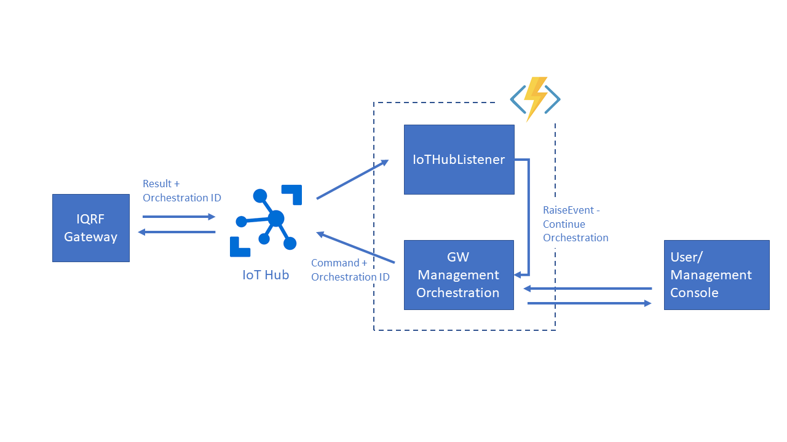
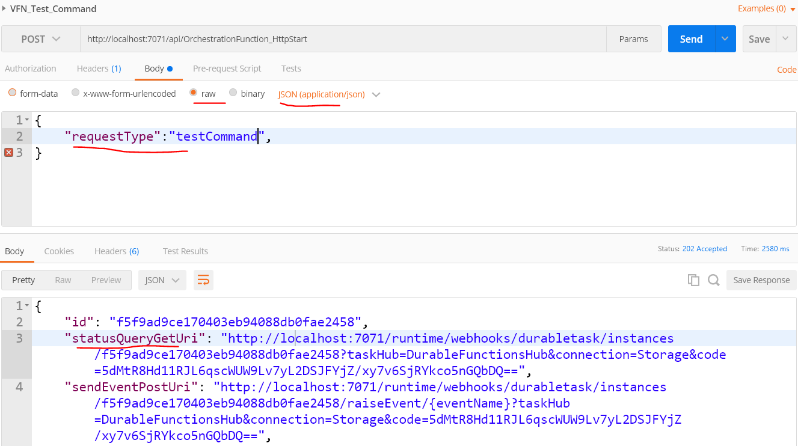

# Correlating IoT Hub C2D and D2C messages with Durable Functions

This repository contains code sample which implements correlation of IoT Hub C2D and D2C messages and  thus enables asynchronous request-response communication model thru IoT Hub messaging feature. This article expects you have previous knowledge on Azure Durable Functions and Azure IoT Hub.

Our need to correlate IoT Hub C2D and D2C messages arose during work within IoT project we worked on. We have used SW IoT gateway ([SW Gateway Deamon solution from IQRF](https://www.iqrf.org/technology/iqrf-gw-daemon) )  deployable to wide range of devices (including Raspberry PI), which surfaces it's management API thru IoT Hub messaging. More specifically it is capable to receive management commands thru direct cloud to device (C2D - request) messages sent thru IoT Hub and subsequently send response thru device to cloud (D2C) message. Aim of project was to built mobile management application. To achieve that we needed to implement management console for such device, we need to build backend which will handle communication with the device thru IoT Hub. 

In case of device management implemented using messages floating thru IoT Hub there is need to perform following steps: 

- Initiate command (User/Management Console)
- Send command to device thru IoT Hub (C2D)
-  Receive and process results from device (D2C)
-  Provide results back to user or management console  

To enable such manner of management we decided to utilize **durable functions** and it's orchestration context and built solution with following architecture:



This repository implements overstated architecture. This repository contains two projects: 

- *GWManagementFunctions* - Durable Functions backend used by GW management application
- *SimulatedIQRFGW* -  simple custom simulated device, which communicates with IoT Hub. 

Below we describe individual components to the solution.

#### GW Management Orchestration Function

GW Management Orchestration function is durable function which starts orchestrator context. This orchestration contains two patterns, namely [functions chaining](https://docs.microsoft.com/en-us/azure/azure-functions/durable/durable-functions-concepts#chaining) and [human interaction](https://docs.microsoft.com/en-us/azure/azure-functions/durable/durable-functions-concepts#human), or better said approval process, as we do not involve human. This function gets invoked by the command in form of REST request coming from management mobile application (for demo purposes just Postman or other REST request generator tool). It chains two pieces of logic. First encapsulated within *SentDirectMessageToGW* function is forwarding command to GW device thru IoT Hub in form of C2D message. Important to note is, that json message contains *msgId* field , which holds the id of orchestration, which is later forwarded from GW device in D2C message and received by *IoTHubListener* function. Thanks to that, we are able to correlate result received from IoT Hub with related instance of durable functions and ultimately with original request/command. 

```C#
public class GWManagementOrchestrationCommand
{
    [FunctionName("GWSendCommandWithResponse")]
    public static async Task<string> GWSendCommandWithResponse(
        [OrchestrationTrigger] DurableOrchestrationContext context)
    {
        //Read input
        string input = context.GetInput<string>();
        if (input == "TestCommand")
        {
            await context.CallActivityAsync<string>("SentDirectMessageToGW", $"{{\"msgId\":\"{context.InstanceId}\"}}");
        }
        else
        {
            //sending orchestration context id as msgId field.
            //msgId is being resent back by IQRF GW together with results for the invoked command.
            //This enables correlation of D2C messages floating to IoTHub with original commands sent as C2D messages
            var json = input.Replace("#MSG_ID#", context.InstanceId);
            await context.CallActivityAsync<string>("SentDirectMessageToGW", json);
        }
            
        using (var timeoutCts = new CancellationTokenSource())
        {
            // There is 30 second window for gateway to send response
            DateTime expiration = context.CurrentUtcDateTime.AddSeconds(30);
            Task timeoutTask = context.CreateTimer(expiration, timeoutCts.Token);

            Task<string> gwIoTHuBResponseTask =
                context.WaitForExternalEvent<string>("GWIoTHubResponse");

            Task winner = await Task.WhenAny(gwIoTHuBResponseTask, timeoutTask);
            if (winner == gwIoTHuBResponseTask)
            {
                timeoutCts.Cancel();
                //We received response from GW
                return gwIoTHuBResponseTask.Result;
            }
        }
        return "Response did not arrive";
    }

    /// <summary>
    /// Send command thru IoT Hub direct message (C2D)
    /// </summary>
    /// <param name="message"></param>
    /// <param name="log"></param>
    /// <returns></returns>
    [FunctionName("SentDirectMessageToGW")]
    public static async Task<bool> SentDirectMessageToGW([ActivityTrigger] string message, ILogger log)
    {
        log.LogInformation("Sending Cloud-to-Device message");

        var serviceClient = ServiceClient.CreateFromConnectionString(Environment.GetEnvironmentVariable("IoTHubConnectionString"));

        //send message to device
        var commandMessage = new Message(Encoding.UTF8.GetBytes(message)) { Ack = DeliveryAcknowledgement.Full };
        await serviceClient.SendAsync(Environment.GetEnvironmentVariable("DeviceId"), commandMessage);

        //wait for ACK from device
        await ReceiveFeedbackAsync(serviceClient, log);

        return true;
    }  

    /// <summary>
    /// Receives the message ACK from the device (async).
    /// </summary>
    /// <param name="serviceClient">The service client.</param>
    /// <param name="token">The token.</param>
    /// <returns></returns>
    private static async Task ReceiveFeedbackAsync(ServiceClient serviceClient, ILogger log)
    {
        var feedbackReceiver = serviceClient.GetFeedbackReceiver();
        log.LogInformation("Waiting for C2D message receive ACK from service");

        var result = await feedbackReceiver.ReceiveAsync(TimeSpan.FromSeconds(1));

        //TODO implement logic for case when no ACK arrives
        if (result == null) return;

        log.LogInformation("Received ACK: {0}", string.Join(", ", result.Records.Select(f => f.StatusCode)));

        await feedbackReceiver.CompleteAsync(result);
    }
}
```

Once C2D message is sent and ACK from device is received, orchestrator function continues and sets [durable timer](https://docs.microsoft.com/en-us/azure/azure-functions/durable/durable-functions-timers) which determines maximum waiting time for result to arrive from GW device (thru IoT Hub).  The orchestrator then waits for an [external event](https://docs.microsoft.com/en-us/azure/azure-functions/durable/durable-functions-external-events) to appear (event raised by *IoTHubListener* function ) or for timer to run out. In case it is first option, orchestrator provides response from device to management mobile application thru its *statusQueryGetUri* endpoint provided automatically by orchestration context. 

#### IQRF Gateway device

As stated, for the demonstration purposes IQRF Gateway is implemented only as simple IoT Hub connected device, which receives messages from IoT Hub and sends response back in form of D2C message. This message contains *msgId* field used to correlate original request with result message.

```C#
//Program.cs
 private static async Task ReceiveCommands(DeviceClient deviceClient)
 {
     Console.WriteLine("\nDevice waiting for commands from IoTHub...\n");
     Console.WriteLine("Use the IoT Hub Azure Portal to send a message to this device.\n");

     Message receivedMessage;
     string messageData;

     //Wait for message with default timeout
     receivedMessage = await deviceClient.ReceiveAsync();

     if (receivedMessage != null)
     {
         messageData = Encoding.ASCII.GetString(receivedMessage.GetBytes());
         Console.WriteLine("\t{0}> Received message: {1}", DateTime.Now.ToLocalTime(), messageData);

         try
         {
             dynamic jsonObject = JsonConvert.DeserializeObject(messageData);

             //Resend orchestrationId as part of response being sent thru IoTHub (D2C)
             //In real scenario this message will contain response to command
             Message eventMessage = new Message(Encoding.UTF8.GetBytes($"{{\"msgId\":\"{jsonObject.msgId}\"}}"));
             await deviceClient.SendEventAsync(eventMessage).ConfigureAwait(false);
         }
         catch(Exception e) {
             Console.WriteLine(e.Message);
         }

         //Mark message as completed/processed
         await deviceClient.CompleteAsync(receivedMessage);
     }
     else
     {
         Console.WriteLine("\t{0}> Timed out", DateTime.Now.ToLocalTime());
     }
               
```


#### IoT Hub Listener

IoT Hub Listener is simple Azure Function triggered by new telemetry message arriving to IoT Hub. As this function is running within the same Function App as GW Management Orchestration function, we can use *DurableOrchestrationClient* to raise event and to "wake up" orchestration process, as they share the same context. To continue respective orchestration context, we use *msgId* field of received message, which holds value of orchestration Id.

```C#
[FunctionName("IoTHubListener")]
public static async Task Run([IoTHubTrigger("messages/events", Connection = "IoTHubEventHubEndpointConnectionString")]EventData message,
            ILogger log,
            [OrchestrationClient] DurableOrchestrationClient client)
{

    log.LogInformation($"C# IoT Hub trigger function processed a message: {Encoding.UTF8.GetString(message.Body.Array)}");

    var s = Encoding.UTF8.GetString(message.Body.Array).Replace("{eventName}", "GWIoTHubResponse");
    dynamic jsonObject = JsonConvert.DeserializeObject(s);

    //Raising event - waking up respective orchestration context 
    await client.RaiseEventAsync($"{jsonObject.msgId}", "GWIoTHubResponse", s);
}
```

### Invoking complex management actions on IQRF Gateway

Usually management actions on IQRF gateway consist of several commands/activities that need to be invoked. For example, if we simplify unbonding sensor from gateway device, gateway requires to wait for the sensor to wake up (sensor can be asleep to save battery life) only then unbonding command can be invoked. At the end there is also need to update database, which stores list of connected sensors in database. We solved this by creating Durable Functions orchestration hierarchies. 

Main orchestration context is chaining several sub orchestrations (in this case three) in order to invoke all necessary commands. If specific step requires invocation of command on GW, it is invoked thru within sub orchestration  using *GWManagementOrchestrationFunction* which encapsulates logic for C2D and D2C message correlation. This function is invoked with different json payload based on the type of command that needs to be executed. See implementation of device unboding logic bellow. Please not, that *DeviceSleepCheck* and *InvokeDatabaseOperation* activities are bit more complex and are implemented as separate functions. We state their code below as well.

```C#
public static class GWManagementOrchestrationAction
{
    [FunctionName("GWManagementAction")]
    public static async Task<string> RunGWManagementAction(
        [OrchestrationTrigger] DurableOrchestrationContext context, Microsoft.Azure.WebJobs.ExecutionContext executionContext, ILogger log)
    {
        string result = "";
        string reqBody = context.GetInput<string>();
        dynamic reqBodyJsonObject = JsonConvert.DeserializeObject(reqBody);

        var jsonTempaltesPath = System.IO.Path.Combine(executionContext.FunctionDirectory, @"..\json_templates");
        string json;

        switch ($"{ reqBodyJsonObject.requestType}")
        {
            case "unbondDevice":

                //1. Wait for device to wake up
                //Setting custom status
                context.SetCustomStatus("{\"Status\":\"Device is Sleeping\"}");
                await context.CallSubOrchestratorAsync<ResponseObject>("DeviceSleepCheck", reqBodyJsonObject.devAddr);
                context.SetCustomStatus("{\"Status\":\"Device has woken up\"}");

                //2. Remove bonded sensor from GW
                context.SetCustomStatus($"{{\"Status\":\"Removing device from GW\"}}");
                json = System.IO.File.ReadAllText(jsonTempaltesPath + @"\remove_bonded_device.json");
                json = json.Replace("#DEV_ADDR#", $"{reqBodyJsonObject.devAddr}");

                result = await context.CallSubOrchestratorAsync<string>("GWSendCommandWithResponse", json);

                //3. Update DB
                context.SetCustomStatus($"{{\"Status\":\"Updating DB entry\"}}");
                string unbondQuery = "UPDATE dbo.Sensor " +
                    $"SET [GatewayIndex] = NULL, [GatewayID] = NULL WHERE ID = {reqBodyJsonObject.sensorID}";
                await context.CallActivityAsync<string>("InvokeDatabaseOperation", unbondQuery);

                break;

            case "testCommand":
                result = await context.CallSubOrchestratorAsync<string>("GWSendCommandWithResponse", "testCommand");
                break;

            default:
                break;
        }

        return result;
    }
    ...
```

**Sleep check** goes one level deeper when it comes to sub orchestration hierarchy. It is itself ran as monitor orchestrator function and every run it executes *GWSendCommandWithResponse* sub orchestration. It repeatedly asks GW for device enumeration. Based on the result, it is capable to say, if sensor to be unbonded is asleep or not. If it is, it schedules next check in 10 seconds. If device is woken up, it finishes execution and returns  execution control back to parent orchestration. Below you can find implementation of Sleep Check logic.

```c#
public static class DeviceManagementOperations
{

    /// <summary>
    /// Checks if device sleeps and if so waits for it to wake up
    /// </summary>
    /// <param name="context"></param>
    /// <param name="executionContext"></param>
    /// <param name="log"></param>
    /// <returns></returns>
    [FunctionName("DeviceSleepCheck")]
    public static async Task<ResponseObject> DeviceSleepCheck(
        [OrchestrationTrigger] DurableOrchestrationContext context, Microsoft.Azure.WebJobs.ExecutionContext executionContext, ILogger log)
    {
        var devAddr = context.GetInput<string>();
        var jsonTempaltesPath = Path.Combine(executionContext.FunctionDirectory, @"..\json_templates");
        var json = File.ReadAllText(jsonTempaltesPath + @"\enumerate.json");

        json = json.Replace("#DEV_ADDR#", $"{devAddr}");

        while (true)
        {
            var resEnum = await context.CallSubOrchestratorAsync<string>("GWSendCommandWithResponse", json);
     

            var errorMessage = Utils.CheckResponse(resEnum, out dynamic resEnumJObject);
            if (errorMessage != "" && resEnumJObject.data.statusStr != "info missing")
            {
                log.LogInformation("Enumerate error: " + errorMessage);
                return new ResponseObject(ResultMessages.ErrorResult, ResultMessages.DiscoveryError, errorMessage);
            }

            if (resEnumJObject.data.statusStr != "info missing")
                return new ResponseObject(ResultMessages.Success, ResultMessages.EnumerateSuccess, resEnum);
            else
            {
                // Orchestration sleeps until this time.
                var nextCheck = context.CurrentUtcDateTime.AddSeconds(10);
                await context.CreateTimer(nextCheck, CancellationToken.None);
            }
              
        }
    }
}
```

*InvokeDatabaseOperation*  is simple activity triggered durable function, which connects to database and updates respective rows, after sensor was unbonded.

```C#
public class DatabaseOperation
{
    /// <summary>
    /// Invoke database update command
    /// </summary>
    /// <param name="message"></param>
    /// <param name="log"></param>
    /// <returns></returns>
    [FunctionName("InvokeDatabaseOperation")]
    public static async Task<bool> InvokeDatabaseOperation([ActivityTrigger] string query, ILogger log)
    {
        // Get the connection string from app settings and use it to create a connection.
        var str = Environment.GetEnvironmentVariable("sqldb_connection");
        try
        {
            using (SqlConnection conn = new SqlConnection(str))
            {
                conn.Open();

                using (SqlCommand cmd = new SqlCommand(query, conn))
                {
                    // Execute the command and log the # rows affected.
                    var rows = await cmd.ExecuteNonQueryAsync();
                    log.LogInformation($"{rows} rows were updated");
                }
            }
        }
        catch (Exception e)
        {
            log.LogInformation(e.Message);
        }

        return true;
    }
}
```

### How to run the sample?

In order to run this sample, you will need to have instance of IoT Hub running in Azure and existing device identity. Once you have those, please set values for connection strings in *local.settings.json* file (located in GWManagementFunctions project) and in *AppSettings.json* file (located in SimulatedIQRFGW project)

Set multiple startup projects and let run both of the projects in the solution.  Open Postman or other REST request tool and invoke POST request with following settings:




If your function job host is running on different port, please set the port appropriately. 

Durable Function orchesration context should provide you with status check url (*statusQueryGetUri*). Once the whole communication flow of C2D and D2C messaging runs, you will be provided response on this URL.

Note that simulated IQRF device is capable to send only simple response and more complex flow of device unbond won't work, with this simulated device.

### Summary

Using Durable Functions orchestration patterns, we have implemented solution which enables correlation of C2D and D2C messages. It basically provides asynchronous request response communication model on top of IoT Hub's C2D and D2C messaging feature. Feel free to reuse, if you need to implement similar communication model in your solution.